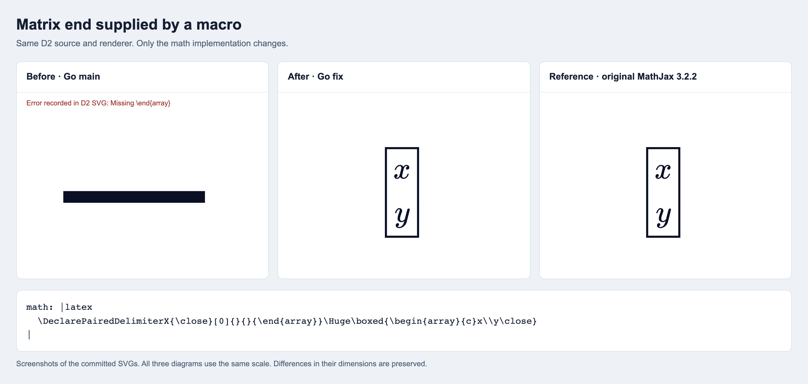

# A macro can supply an array end

The same D2 source and renderer are used in all three panels. The former Go renderer reports an error; the repaired renderer produces the formula that original MathJax 3.2.2 produces. The complete after and original SVGs are byte-identical.

[Before SVG](before.svg) · [After SVG](after.svg) · [Original SVG](original.svg) · [D2 source](witness.d2)

The screenshot displays the actual SVGs at one common scale. It preserves the different diagram dimensions and the original error bar. No paths or styles were changed for the comparison.

`manifest.json` binds the math implementations, D2 renderer, binaries, frozen original assets, and every artifact. The before binary uses the same production code as actual main `a85eebd`; the after binary uses source `3c9e0bd`. Build D2 with the corresponding local mathjax-go replacement, then run `d2 --pad 24 --scale 1 --omit-version witness.d2 after.svg`. The original uses the frozen adapter under `../accent-italic-correction/oracle-adapter` and the pinned unmodified MathJax assets.
